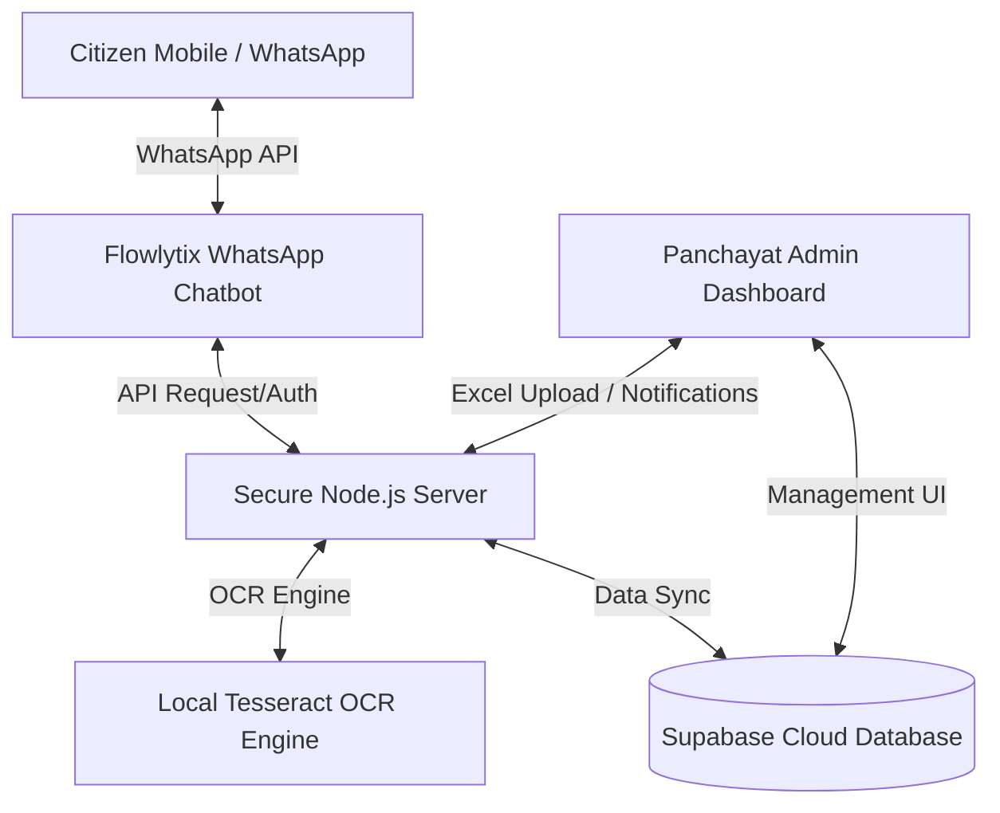

# 🏛️ Gram Panchayat & Taluka Digital Transformation Platform
### *Empowering Local Governance, Automating Tax Collection, and Enhancing Citizen Services*

**A Solution Designed & Delivered by [Flowlytix](https://flowlytix.in)**  
*Contact: [info@flowlytix.in](mailto:info@flowlytix.in) | Website: [flowlytix.in](https://flowlytix.in)*

---

## 🎯 Executive Summary

Local governance bodies (Gram Panchayats and Talukas) in India are the first point of contact for millions of citizens. However, they face severe operational challenges:
* **Manual Document Retrieval**: Long queues and administrative delays in fetching birth/marriage certificates, land records, or business registrations.
* **Low Property Tax Recovery**: Inefficient paper-bill dispatch leading to massive revenue leakages and collection bottlenecks.
* **Complex Digital Solutions**: Existing portal-based citizen services require computer literacy, usernames, passwords, and stable desktop internet connections.

**Flowlytix** presents a unified **WhatsApp & Administration Dashboard Solution**—a highly intuitive, scalable, and plug-and-play platform. It brings the entire Panchayat office directly to the citizen's mobile screen using India's most ubiquitous app: **WhatsApp**.

> [!TIP]
> Since WhatsApp requires zero training for citizens, adoption rates exceed 95%, making it the single most effective channel for local governance and tax recovery.

---

## 🌟 Core System Pillars

The Flowlytix solution is divided into three seamlessly integrated modules:



### 1. The Citizen WhatsApp Chatbot
A 24/7 automated service assistant operating in local languages (Hindi, Gujarati, etc.) and English.
* **Blank Application Forms**: Citizens can view and instantly download blank application forms (e.g. Birth Certificate, Water Connection, Building Permission) with zero authentication required.
* **Secure Document Delivery**: Citizens can retrieve personal documents (e.g., identity certificates, land documents) directly.
  - *Multi-Factor Authentication*: Matches registered mobile number, matches full name, and verifies last 4 digits of Aadhaar.
  - *Data Privacy*: Delivered PDFs are password-encrypted using the citizen's Date of Birth (`DDMMYYYY`) to prevent unauthorized access.
* **Online Tax Payment**: Outstanding dues are instantly fetched and a dynamic UPI payment QR code/link is sent on-the-fly.

### 2. The Smart Payment & OCR Verification Engine
Eliminates the requirement for complex payment gateway setups (like Razorpay) and merchant transaction fees by utilizing local UPI.
* **Dynamic QR Code Generation**: Generates high-quality UPI QR codes pre-filled with the exact due amount, payee name, and a unique tracking tag (`TXID=property_id`) in the transaction note.
* **Stateless Receipt Verification**: The citizen uploads a screenshot of the payment receipt. The local AI OCR engine scans the image to verify:
  1. Payee UPI ID matches configuration.
  2. Transaction Amount matches due amount.
  3. Note contains the correct `TXID`.
* **Instant Confirmation**: Once verified, the database is instantly updated to `'paid'`, logging transaction parameters, and a digital payment confirmation is texted back to the citizen.

### 3. The Panchayat Administration Dashboard
A unified control panel for Panchayat Secretaries, Sarpanchs, and Taluka Officers.
* **Financial Oversight & Analytics**: Real-time metrics on total pending dues, collected tax, count of property owners, and overall collection rates.
* **Excel Data Importer**: Onboard thousands of property records in seconds by uploading a simple Excel worksheet. The system automatically handles duplicate detection and upserts records.
* **Bulk Circular Dispatcher**: Craft personalized messages (e.g., *"Dear {owner_name}, Property tax due for ID: *{property_id}* is ₹{due_amount}..."*), automatically generate unique QR codes for every pending user, and dispatch them to thousands of residents simultaneously via WhatsApp.
* **Audit & Security Logs**: Comprehensive tracking of all database modifications, document downloads, verification attempts, and failed authorization blocks.

---

## 🚀 Why Flowlytix? (The Taluka Advantage)

| Feature | Legacy Portals | Flowlytix WhatsApp Platform |
| :--- | :--- | :--- |
| **Citizen Accessibility** | Requires PC, web browsers, login passwords | Works on any smartphone with basic WhatsApp |
| **Merchant Costs** | 1.5% - 3% transaction gateway charges | **0% transaction fees** (Direct Bank-to-Bank UPI) |
| **Payment Verification** | Manual bank statements checking (Takes days) | **Instant automated AI OCR** (Takes seconds) |
| **Notice Dispatch** | Paper circulars (High cost, lost in transit) | **Bulk Whatsapp alerts** with custom QR codes |
| **Citizen Security** | Open download links | **Password-protected PDF** matching Dob validation |
| **Onboarding Speed** | Months of system setup | **Plug-and-play** via Excel templates |

---

## 🛠️ Implementation & Technical Architecture

The platform uses state-of-the-art, lightweight technologies ensuring lightning-fast load times and minimal deployment costs:

* **Backend Engine**: Node.js & Express API server.
* **AI OCR Processing**: Localized Tesseract engine (runs entirely inside the server; zero external API costs or data sharing).
* **Database & Auth**: Supabase (PostgreSQL) with Row-Level Security (RLS) policies.
* **Admin Interface**: Next.js (React) styled with modern vanilla CSS (vibrant metrics cards, glassmorphic UI, responsive tables).
* **WhatsApp Gateway Wrapper**: Agnostic communication handler supporting:
  - *Direct Twilio WhatsApp API Integration* (ideal for staging and sandbox testing).
  - *Interakt WhatsApp API* (for high-volume template-driven production broadcasts).

> [!IMPORTANT]
> **Data Localization and Security**:
> Citizen data never leaves the state/local jurisdiction. Tesseract OCR processing is performed in-memory on the local server. Uploaded receipts are stored securely and purged automatically after 10 minutes to maintain storage cleanliness.

---

## 📈 Integration Roadmap for Talukas & Districts

Flowlytix has designed the onboarding framework to be completely friction-free for administrators:

```mermaid
chronology
    title 4-Week Rapid Deployment Framework
    section Onboarding
        Day 1 - 5 : Data Schema Mapping : Panchayat exports existing property tax registries into Flowlytix Excel Templates.
    section Setup
        Day 6 - 12 : Infrastructure Setup : Provisioning database instances and configuring UPI/WhatsApp gateways.
    section Pilot
        Day 13 - 20 : Pilot Testing : Sandbox tests for chatbot dialogues, OCR accuracy, and dashboard exports.
    section Launch
        Day 21 - 28 : District Rollout & Training : Training Gram Sevaks and circular broadcast launch.
```

1. **Excel Template Standardization**: Panchayats populate simple columns: `Property ID`, `Owner Name`, `Mobile`, and `Due Amount`.
2. **One-Click Import**: Secretarial staff upload the file onto the dashboard.
3. **Instant Circular Broadcasting**: Admin triggers the Circular module. Within minutes, every pending citizen receives their personalized QR code and payment link on their phone.
4. **Automated Verification Loop**: As citizens pay and send receipts back, the dashboard metrics update in real-time, requiring zero manual bookkeeping.

---

## 💼 Commercial Partnership

At **Flowlytix**, we believe in transforming local governance with maximum efficiency and minimal overhead. We offer flexible licensing models:
* **Per-Panchayat SaaS Model**: Low monthly subscription covering hosting, databases, dashboard access, and automated updates.
* **District/Taluka Enterprise Package**: Centralized district-level multi-tenant hosting, enabling Taluka Development Officers (TDO) to monitor tax recovery progress across all constituent Gram Panchayats from a single master dashboard.

**Partner with Flowlytix to build the future of Digital Local Governance.**

*Let's digitise your Gram Panchayat today.*  
🌐 **Visit us at:** [flowlytix.in](https://flowlytix.in)  
📧 **Email:** [info@flowlytix.in](mailto:info@flowlytix.in)
